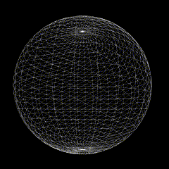
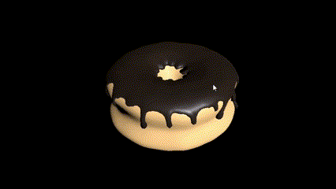

# ⚔️Welcome to my Three.js exploratory project⚔️

## Overview

The project aims to explore the Three.js library and its possibilities.

## Motivation

I came across so many amazing projects using Three.js that I wanted to try it myself.
I started with the [three.js Official Docs : Intro #Creating a scene](https://threejs.org/docs/index.html#manual/en/introduction/Creating-a-scene) and then I tried to make my own project.

## How to run the project

### Prerequisites

You need to have [Node.js](https://nodejs.org/en/) installed on your computer.

### Install the dependencies

```npm install```

### OPTION 1 : Run the project

```npx vite```

### OPTION 2 : Deploy the project (Generate a dist folder)

```npx vite build```

#### Then run the project from the dist folder

```npm vite run```

## The first draft

- A sphere that rotates slowly by itself.
- The sphere can be rotated by dragging the mouse (Invert X,Y).
- Zoom in and out with the mouse wheel.



## The second draft

[On production at https://hello-three-three.vercel.app/](https://hello-three-three.vercel.app/)

- Without an experience in 3D modelling, I made a 3D donut model [Thanks to Blender Guru Tutorial!](https://www.youtube.com/watch?v=nIoXOplUvAw&list=PLjEaoINr3zgFX8ZsChQVQsuDSjEqdWMAD) Following the tutorial, I made a donut with a chocolate glaze and learned how to use Blender to do modelling, sculpting, texturing, lighting, rendering and compositing and finally exporting the model to a GLTF file.
- I utilize the [OrbitControls](https://threejs.org/docs/#examples/en/controls/OrbitControls) library to control the camera instead of the self-made controls.
- I utilize the [GLTFLoader](https://threejs.org/docs/#examples/en/loaders/GLTFLoader) library to load a 3D model of a donut.
- I utilize vite.config.js to handle static assets.


